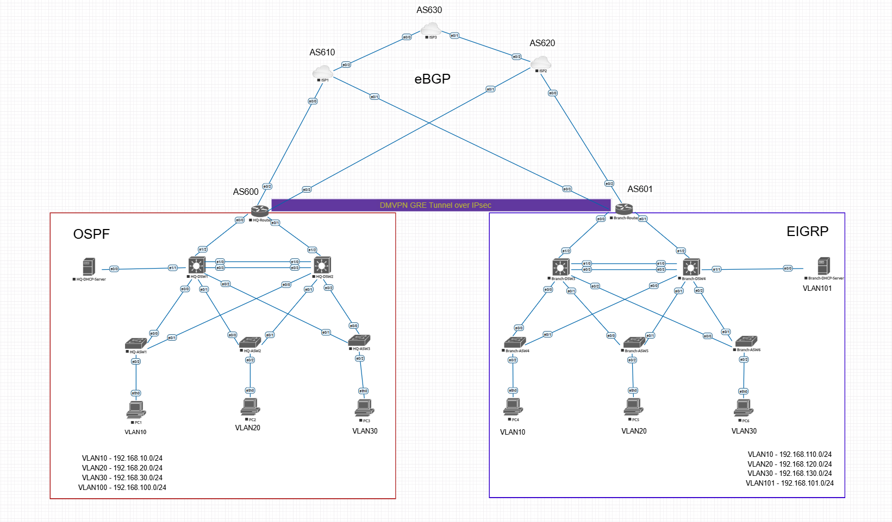

# 🌐 Enterprise Multi-Site & Multi-ISP Cisco Network Architecture

## 📌 Project Overview
This project presents an end-to-end simulation of a resilient, secure, and highly available Enterprise Network Architecture designed in **EVE-NG**. 

The network spans a corporate **Headquarters (HQ)** running **OSPF**, a **Branch Office** running **EIGRP**, an overlay **DMVPN GRE Tunnel over IPsec** for inter-site WAN security, and **Multi-Homed eBGP** connections across three independent Autonomous Systems (AS610, AS620, AS630)

---
## 🚀 Architectural Highlights

A comprehensive breakdown of the core infrastructure design and protocols:

* **Network Topology:** Centralized HQ connected to a fault-tolerant Remote Branch.
* **WAN Edge Connectivity:** Dual-homed ISP connections supporting active/backup path redundancy.
* **Encrypted Overlays:** DMVPN Phase 3 with tunnel configuration for secure site-to-site transport.
* **Underlay Routing:** External BGP (eBGP) peering established across public service providers.
* **Overlay Routing:** static routes running over DMVPN tunnels for internal WAN route propagation.
* **Branch Core & Distribution:** EIGRP powering the internal Branch backbone (AS-601).
* **Protocol Redistribution:** Bidirectional route redistribution secured with Route-Maps and Route-Tags to prevent routing loops.
* **Gateway Redundancy:** VRRP and HSRP configured at the HQ and Branch Distribution layer for seamless default gateway failover.
* **Layer 2 Infrastructure:** Rapid PVST+ paired with LACP & PAgP EtherChannel for link aggregation and loop-free switching.
* **Proactive SLA Tracking:** IP SLA combined with Object Tracking to monitor link performance and trigger automated failovers.
* **Edge Security & NAT:** Route-Map guided Policy-Based Port Address Translation (PAT).
* **Switchport Hardening:** Layer 2 defense mechanisms mitigating DHCP rogue attacks, ARP spoofing, and untrusted access.

---

## 🎯 Design Objectives

Key engineering goals guiding the architectural choices in this deployment:

* **High Availability:** Elimination of single points of failure across all Layer 2 and Layer 3 paths.
* **Automated WAN Failover:** Instant, hands-free traffic rerouting upon primary circuit degradation or outage.
* **Predictable Convergence:** Fast and deterministic network convergence during link or node disruptions.
* **Robust Campus Hardening:** Strict Layer 2 mitigation using DHCP Snooping, Dynamic ARP Inspection (DAI), and Port Security.
* **Scalable Architecture:** Modular DMVPN framework built for frictionless branch onboarding in the future.
* **Routing Isolation:** Clean separation between SP-facing eBGP sessions and internal enterprise routing domains

---

## 🛠️ Detailed Technical Documentation

To keep the overview concise, the complete low-level engineering specifications, subnet allocations, and failover design parameters have been segmented into dedicated architectural documents:

* 📊 **[Addressing & VLAN Plan](Address&Routing/Addressing&Routing.md)** – Comprehensive subnet tables for HQ LAN, Branch LAN, and WAN point-to-point links.
* 🔄 **[NAT Failover Trobuleshooting](trobuleshoot/trobuleshooting.md)** – Detailed analysis and resolution for asymmetric routing and NAT drops.
---
## 🛡️ Access Layer & Layer 2 Security (Access Switches)

### 1. Advanced L2 Attack Mitigation
- **DHCP Snooping**: Configured all edge ports as `untrusted` while setting uplinks to Distribution Switches and infrastructure servers as `trusted`. Prevents DHCP Spoofing and DHCP Starvation attacks.
- **Dynamic ARP Inspection (DAI)**: Intercepts ARP requests and responses on untrusted ports, validating them against the DHCP Snooping Binding Table to mitigate ARP Poisoning and Man-in-the-Middle (MitM) attacks.
- **IP Source Guard (IPSG)**: Cross-references inbound IP and MAC traffic against the DHCP Snooping database to prevent IP address spoofing.
- **Port Security**:
  - Constrained port capacity to `maximum 1` MAC address.
  - Enabled dynamic MAC learning and persistence using `mac-address sticky`.
  - Configured `violation shutdown` mode to put offending switchports into `err-disable` upon detecting unauthorized device connections.

### 2. Spanning Tree Protocol (STP) Hardening
- **PortFast**: Enabled on all end-user access ports for immediate entry into the Forwarding state, bypassing STP Listening and Learning states.
- **BPDU Guard**: Applied to edge ports to instantly disable any port receiving unauthorized BPDU frames, protecting against rogue switch deployment and STP topology loops.

### 3. Trunk Security & Infrastructure Protection
- **Native VLAN Hardening**: Changed the default Native VLAN from `VLAN 1` to an unused isolated VLAN (`VLAN 999`) to prevent Double-Tagging VLAN Hopping attacks.
- **DTP Mitigation**: Disabled Dynamic Trunking Protocol using `switchport nonegotiate` to eliminate DTP spoofing vulnerabilities.

---

## ⚙️ Core Infrastructure, HA & Management Plane

### 1. Management Plane Hardening
- **Session Timeout**: Enforced `exec-timeout 5 0` on Console and VTY lines to terminate inactive administrative sessions after 5 minutes.
- **Banners**: Configured legal compliance notices via `banner motd` warning unauthorized users that access is restricted and monitored.

### 2. High Availability & Gateway Redundancy
- **Link Aggregation**: Configured IEEE 802.3ad **LACP EtherChannel** trunks across switches to provide high-bandwidth redundant interconnects.
- **FHRP (HSRP / VRRP)**: Configured active/standby virtual gateway redundancy across Distribution Switches. Implemented Priority tuning, Preemption, and Interface Tracking for rapid failover.

### 3. Routing Engine Security & DHCP Infrastructure
- **Passive Interface Default**: Hardened internal routing protocols (`OSPF` / `EIGRP`) using `passive-interface default`, only enabling adjacency formation on dedicated infrastructure trunks to block unauthorized route injection from host ports.
- **DHCP Relay & Exclusion**:
  - Excluded statically assigned IP pools (e.g., Gateways, VRRP VIPs) via `ip dhcp excluded-address`.
  - Configured `ip helper-address` on SVIs to convert Layer 2 DHCP Broadcasts into Layer 3 Unicast traffic destined for central DHCP servers.

---

## 🌍 WAN Architecture & eBGP Routing Policy

### 1. Transit AS Prevention
- Configured AS-Path Filtering using `ip as-path access-list 1 permit ^$` attached to outbound Route-Maps. Ensures the enterprise network functions purely as an **End-System AS** and does not act as a transit network between ISPs.

### 2. Core Redistribution & Default Route Injection
- Established internal IGP peering between Edge Routers and Core Distribution Switches.
- Redistributed IGP routes into eBGP and dynamically propagated default routes (`default-information originate`) into the internal network.

### 3. Traffic Engineering (Inbound & Outbound)
- **Outbound Traffic Control**: Applied `set local-preference 200` on inbound routes from **ISP1** to designate it as the primary outbound path.
- **Inbound Traffic Control**: Applied **AS-Path Prepending** (`set as-path prepend 600 600 600`) on advertisements towards **ISP2** to influence incoming traffic from external networks to prefer **ISP1**.

### 4. NAT / PAT Failover Configuration
- Defined access control lists (ACLs) matching internal IPv4 source subnets.
- Configured `ip nat inside` and `ip nat outside` on core and WAN interfaces.
- Implemented Port Address Translation (**PAT**) with `overload` tied to active WAN interface IPs to enable secure outbound Internet connectivity.

---

## 🛠️ Technologies & Tools
- **Simulation**: EVE-NG, Debug, Wireshark
- **Network OS**: Cisco IOS / IOS-XE
- **Protocols**: eBGP, OSPF, EIGRP, DMVPN, IPsec, GRE, HSRP, VRRP, LACP, STP, Rapid-PVST
- **Security Protocols**: DHCP Snooping, DAI, IPSG, Port Security, BPDU Guard, , NAT/PAT
