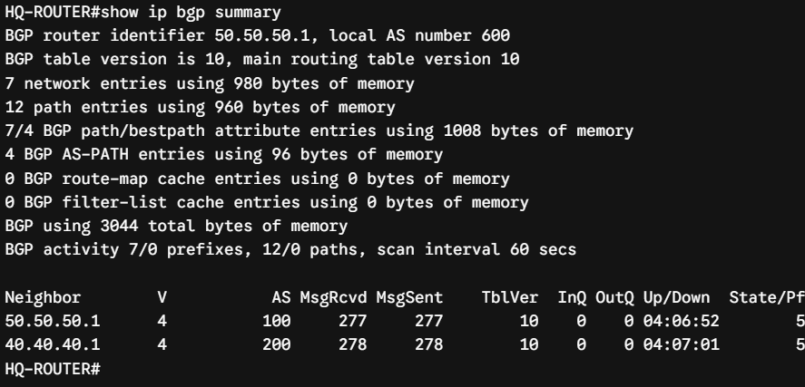
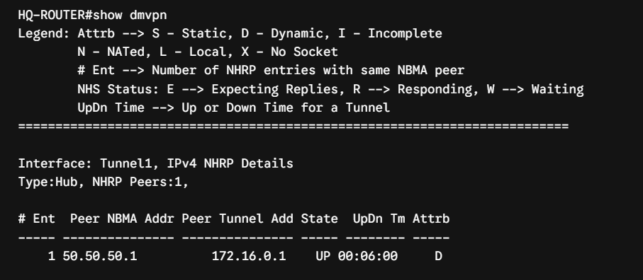
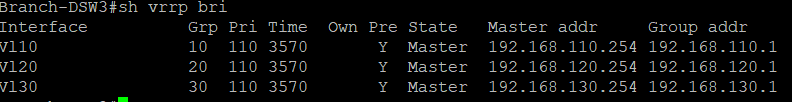
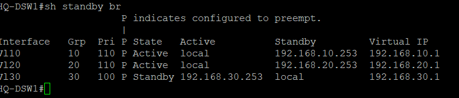
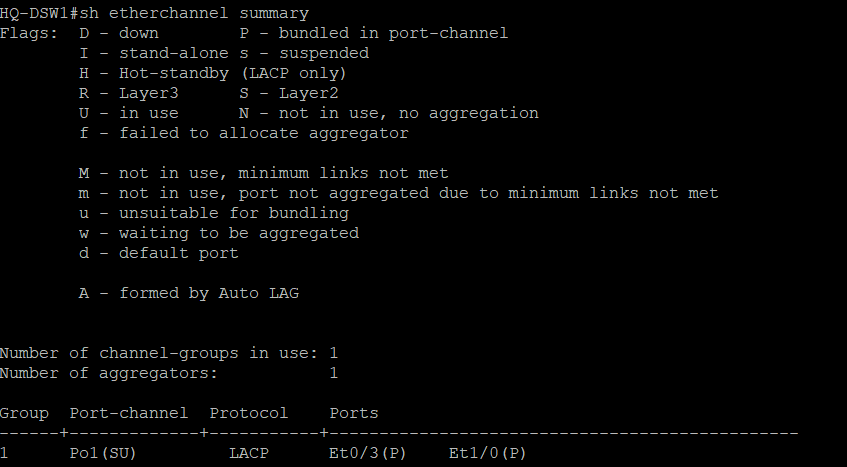
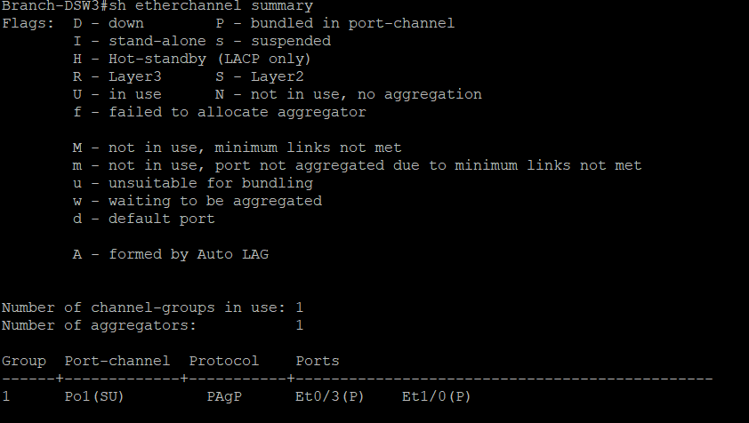

# 🔍 Infrastructure Verification Guide

This document outlines the systematic verification commands used to validate control plane stability, overlay infrastructure health, and deterministic data plane forwarding behavior across the multi-vendor environment.

---

## 🌐 1. Dynamic Routing Verification

### Underlay BGP Peer Validation
To verify that the Edge Routers successfully establish eBGP peerings with the service providers (ISP-1 and ISP-2) and receive correct routing advertisements:

---

## 🔒 2. DMVPN Phase-3 & IPsec Validation

### DMVPN Overlay & NHRP Mapping
Validating the dynamic Next Hop Resolution Protocol (NHRP) registration matrix on the Hub interface for all connected Spoke routers:

---

## 🔄 3. High Availability &

### VRRP Gateway Redundancy
Verifying First Hop Redundancy Protocol (FHRP) state behavior at the core/distribution layer for high-availability gateway redundancy:

### HSRP Gateway Redundancy
Verifying First Hop Redundancy Protocol (FHRP) state behavior at the core/distribution layer for high-availability gateway redundancy:

### Etherchannel LACP

### Etherchannel PAgP

